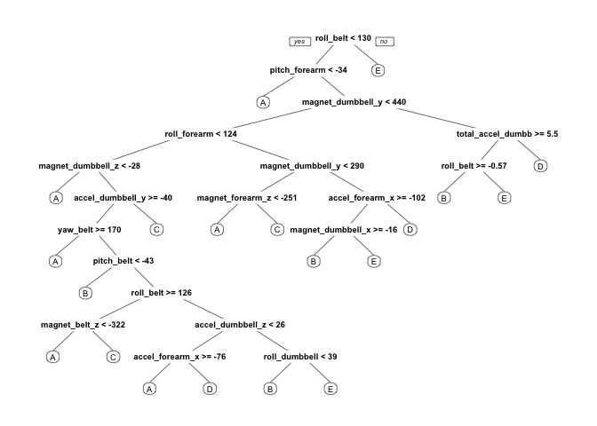

# Movement ML Prediction
Wenting Feng  
1/14/2018  


## Introduction

Using devices such as Jawbone Up, Nike FuelBand, and Fitbit it is now possible to collect a large amount of data about personal activity relatively inexpensively. These type of devices are part of the quantified self movement – a group of enthusiasts who take measurements about themselves regularly to improve their health, to find patterns in their behavior, or because they are tech geeks. One thing that people regularly do is quantify how much of a particular activity they do, but they rarely quantify how well they do it.

Using data from accelerometers on the belt, forearm, arm, and dumbell of 6 participants, this project will predict the manner in which they did the exercise. 

## Data Processing


```r
library(caret)
library(rpart)
library(rpart.plot)
library(gbm)
```

### Download and read the data


```r
train_url <- "https://d396qusza40orc.cloudfront.net/predmachlearn/pml-training.csv"
test_url <- "https://d396qusza40orc.cloudfront.net/predmachlearn/pml-testing.csv"
train_file <- "./data/ml_train.csv"
test_file <- "./data/ml_test.csv"
if (!file.exists("./data")) {
  dir.create("./data")
}
if (!file.exists(train_file)) {
  download.file(train_url, destfile = train_file, method="curl")
}
if (!file.exists(test_file)) {
  download.file(test_url, destfile = test_file, method="curl")
}
```


```r
train_init <- read.csv("./data/ml_train.csv")
test_init <- read.csv("./data/ml_test.csv")
dim(train_init)
```

```
## [1] 19622   160
```

```r
dim(test_init)
```

```
## [1]  20 160
```

The training data set contains 19622 observations and 160 variables, while the testing data set contains 20 observations and 160 variables. As is shown in the requirement, the "classe" variable in the training set is the outcome to predict.

### Clean the data

Since there're incomplete cases in the data sets, first we need to eliminate the missing values and some unnecessary variables. 


```r
# keep complete columns
train_init <- train_init[, colSums(is.na(train_init)) == 0]
test_init <- test_init[, colSums(is.na(test_init)) == 0]
# clean up accelerometer measurements
classe <- train_init$classe
train_omit <- grepl("^X|timestamp|window", names(train_init))
train_init <- train_init[, !train_omit]
train_clean <- train_init[, sapply(train_init, is.numeric)]
train_clean$classe <- classe
test_omit <- grepl("^X|timestamp|window", names(test_init))
test_init <- test_init[, !test_omit]
test_clean <- test_init[, sapply(test_init, is.numeric)]
```

Therefore the cleaned training data set contains 19622 observations and 53 variables, while the testing data set contains 20 observations and 53 variables. And the `classe` variable remains in the data set. 

### Slice the data

Next we need to divide the cleaned training data set into a pure training data set (70%) and a validation data set (30%). The validation data set will be used to conduct cross validation later.


```r
set.seed(35353) 
inTrain <- createDataPartition(y = train_clean$classe, p = 0.7, list = FALSE)
train_data <- train_clean[inTrain, ]
test_data <- train_clean[-inTrain, ]
```

## Data Modeling

Here the model for behavior recognition is **Boosting** algorithm since it can be used with any subset of classifiers. And **3-fold cross validation** will be applied in the algorithm. 


```r
modelFit <- train(classe ~ ., method = "gbm", data = train_data, verbose = F, trControl = trainControl(method = "cv", number = 3))
modelFit
```

```
## Stochastic Gradient Boosting 
## 
## 13737 samples
##    52 predictor
##     5 classes: 'A', 'B', 'C', 'D', 'E' 
## 
## No pre-processing
## Resampling: Cross-Validated (3 fold) 
## Summary of sample sizes: 9159, 9158, 9157 
## Resampling results across tuning parameters:
## 
##   interaction.depth  n.trees  Accuracy   Kappa    
##   1                   50      0.7537312  0.6878541
##   1                  100      0.8224499  0.7752424
##   1                  150      0.8557907  0.8174878
##   2                   50      0.8567374  0.8184545
##   2                  100      0.9059472  0.8809656
##   2                  150      0.9307711  0.9123973
##   3                   50      0.8966292  0.8691172
##   3                  100      0.9420544  0.9266649
##   3                  150      0.9618551  0.9517363
## 
## Tuning parameter 'shrinkage' was held constant at a value of 0.1
## 
## Tuning parameter 'n.minobsinnode' was held constant at a value of 10
## Accuracy was used to select the optimal model using the largest value.
## The final values used for the model were n.trees = 150,
##  interaction.depth = 3, shrinkage = 0.1 and n.minobsinnode = 10.
```

Then we estimate the performance of the model on the validation data set. 


```r
predictFit <- predict(modelFit, test_data)
confusionMatrix(test_data$classe, predictFit)
```

```
## Confusion Matrix and Statistics
## 
##           Reference
## Prediction    A    B    C    D    E
##          A 1643   18    6    5    2
##          B   42 1069   27    1    0
##          C    0   35  977   13    1
##          D    2    6   32  917    7
##          E    1   11    7   17 1046
## 
## Overall Statistics
##                                           
##                Accuracy : 0.9604          
##                  95% CI : (0.9551, 0.9652)
##     No Information Rate : 0.2868          
##     P-Value [Acc > NIR] : < 2.2e-16       
##                                           
##                   Kappa : 0.9499          
##  Mcnemar's Test P-Value : 3.282e-07       
## 
## Statistics by Class:
## 
##                      Class: A Class: B Class: C Class: D Class: E
## Sensitivity            0.9733   0.9385   0.9314   0.9622   0.9905
## Specificity            0.9926   0.9853   0.9899   0.9905   0.9925
## Pos Pred Value         0.9815   0.9385   0.9522   0.9512   0.9667
## Neg Pred Value         0.9893   0.9853   0.9852   0.9927   0.9979
## Prevalence             0.2868   0.1935   0.1782   0.1619   0.1794
## Detection Rate         0.2792   0.1816   0.1660   0.1558   0.1777
## Detection Prevalence   0.2845   0.1935   0.1743   0.1638   0.1839
## Balanced Accuracy      0.9830   0.9619   0.9606   0.9763   0.9915
```

```r
accuracy <- postResample(predictFit, test_data$classe)
accuracy
```

```
##  Accuracy     Kappa 
## 0.9604078 0.9499060
```

```r
sample_error <- 1 - as.numeric(confusionMatrix(test_data$classe, predictFit)$overall[1])
sample_error
```

```
## [1] 0.03959218
```

Now the estimated accuracy of the model is 96.07% and the expected out of sample error is 3.93%.

## Predicting for the test data set


```r
pred <- predict(modelFit, test_clean[, -length(names(test_clean))])
pred
```

```
##  [1] B A B A A E D B A A B C B A E E A B B B
## Levels: A B C D E
```

## Appendix: Figures

Decision Tree


```r
treeModel <- rpart(classe ~ ., data=train_data, method="class")
prp(treeModel) 
```

<!-- -->
